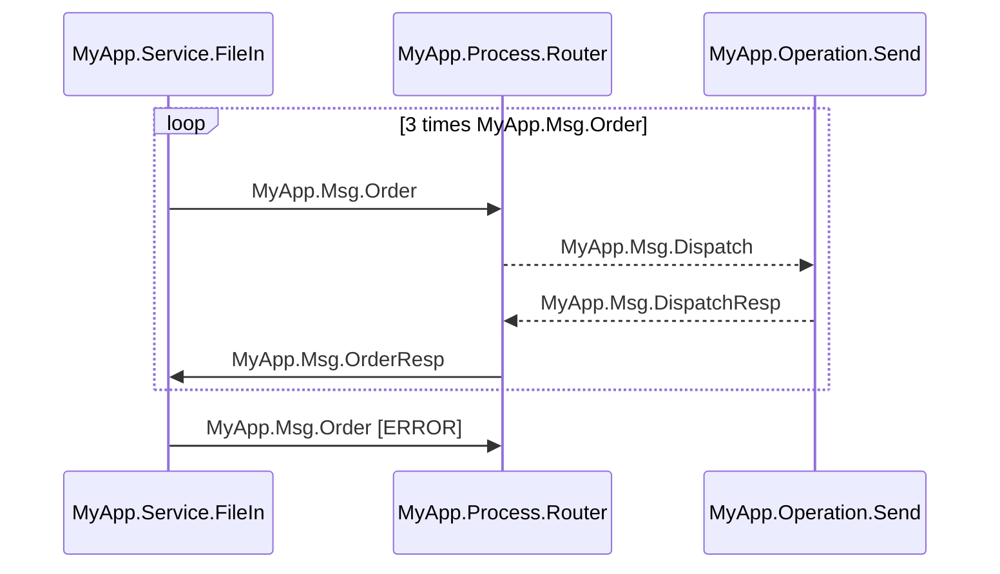

# @iris-mcp/interop

**IRIS Interoperability MCP Server** -- Ensemble/Health Connect production lifecycle, credentials, lookup tables, business rules, data transformations, and REST API management via the Model Context Protocol.

Part of the [IRIS MCP Server Suite](../../README.md).

---

## Installation

```bash
npm install -g @iris-mcp/interop
```

Or run directly without installing:

```bash
npx @iris-mcp/interop
```

---

## Configuration

All servers use the same environment variables:

| Variable | Default | Description |
|----------|---------|-------------|
| `IRIS_HOST` | `localhost` | IRIS hostname or IP |
| `IRIS_PORT` | `52773` | IRIS web server port |
| `IRIS_USERNAME` | `_SYSTEM` | IRIS username |
| `IRIS_PASSWORD` | *(required)* | IRIS password |
| `IRIS_NAMESPACE` | `USER` | Default IRIS namespace |
| `IRIS_HTTPS` | `false` | Use HTTPS instead of HTTP |

### Multiple servers & the `server` parameter

Optionally, set `IRIS_PROFILES` (a JSON map of named IRIS instances) and `IRIS_GOVERNANCE` (a JSON tool-action policy) to target several instances from one server and restrict which actions are allowed. Every tool accepts an optional `server` parameter (a profile name from `IRIS_PROFILES`) that selects which instance the call targets; omit it to use the `default` profile. It composes with the existing per-call `namespace` override. Both variables are **optional and additive** — omit them and this server behaves exactly as a single-instance, fully-enabled install. Full model, escaping, and worked examples: [Multiple Servers & Governance](../../README.md#multiple-servers--governance).

---

## MCP Client Configuration

### Claude Code (`.mcp.json`)

```json
{
  "mcpServers": {
    "iris-interop-mcp": {
      "command": "npx",
      "args": ["-y", "@iris-mcp/interop"],
      "env": {
        "IRIS_HOST": "localhost",
        "IRIS_PORT": "52773",
        "IRIS_USERNAME": "_SYSTEM",
        "IRIS_PASSWORD": "SYS",
        "IRIS_NAMESPACE": "USER"
      }
    }
  }
}
```

### Claude Desktop (`claude_desktop_config.json`)

```json
{
  "mcpServers": {
    "iris-interop-mcp": {
      "command": "npx",
      "args": ["-y", "@iris-mcp/interop"],
      "env": {
        "IRIS_HOST": "localhost",
        "IRIS_PORT": "52773",
        "IRIS_USERNAME": "_SYSTEM",
        "IRIS_PASSWORD": "SYS",
        "IRIS_NAMESPACE": "USER"
      }
    }
  }
}
```

### Cursor

```json
{
  "iris-interop-mcp": {
    "command": "npx",
    "args": ["-y", "@iris-mcp/interop"],
    "env": {
      "IRIS_HOST": "localhost",
      "IRIS_PORT": "52773",
      "IRIS_USERNAME": "_SYSTEM",
      "IRIS_PASSWORD": "SYS",
      "IRIS_NAMESPACE": "USER"
    }
  }
}
```

> **Note:** Replace `"SYS"` with your actual IRIS password. Avoid committing real credentials to version control.

---

## Tool Reference

### Framework Tools

Provided by the shared framework and available on **every** suite server (Epic 19).

| Tool | Description | Key Parameters | Annotations |
|------|-------------|----------------|-------------|
| `iris_server_profiles` | **Call this first.** Reports the configured server-profile roster (non-secret connection metadata — `password` is never included) and the effective governance policy (which actions are enabled/disabled). | `profile?`, `allProfiles?` | readOnly, idempotent |

`iris_server_profiles` is a **read tool, enabled by default**. It reports in-memory config and does not connect to IRIS. Use it to choose the right `server` profile and avoid governance-disabled actions before invoking other tools.

### Production Lifecycle Tools

| Tool | Description | Key Parameters | Annotations |
|------|-------------|----------------|-------------|
| `iris_production_manage` | Create or delete a production | `action`, `name`, `namespace?` | destructive |
| `iris_production_control` | Start, stop, restart, update, recover, or clean | `action`, `name?`, `timeout?`, `force?`, `killAppData?`, `confirm?`, `namespace?` | destructive |
| `iris_production_status` | Get production status with optional detail | `detail?`, `namespace?` | readOnly, idempotent |
| `iris_production_summary` | Cross-namespace production summary | `cursor?` | readOnly, idempotent |

### Production Item & Config Tools

| Tool | Description | Key Parameters | Annotations |
|------|-------------|----------------|-------------|
| `iris_production_item` | Add, remove, enable, disable, get, or set config item settings (set/add accept arbitrary host/adapter settings) | `action`, `itemName`, `className?`, `production?`, `settings?`, `namespace?` | -- |
| `iris_production_autostart` | Get or set auto-start configuration | `action`, `productionName?`, `namespace?` | -- |
| `iris_default_settings_manage` | List, get, set, or delete Interoperability System Default Settings (`Ens.Config.DefaultSettings`) | `action`, `production?`, `item?`, `hostClass?`, `setting?`, `value?`, `description?`, `deployable?`, `namespace?` | destructive |

> **Governance defaults:** the **new write** actions are classified `write` and **disabled by default** under an `IRIS_GOVERNANCE` policy until explicitly allowed — `iris_production_item:add`/`:remove` and `iris_default_settings_manage:set`/`:delete`. The **pre-existing / read** actions are **enabled by default** — `iris_production_item:enable`/`:disable`/`:get`/`:set` (shipped before governance) and `iris_default_settings_manage:list`/`:get`. **Exception — `iris_production_control:clean`** is a new `write` that is nonetheless **enabled by default** (via the `defaultEnabled` marker, Epic 20 decision F2) because it is a recovery operation an operator expects available; it can still be disabled with an explicit `IRIS_GOVERNANCE` override. (A just-`add`-ed config item is not visible to an immediate `get`/`set` until the next add/remove syncs the config extent from the production class — see the `iris_production_item` examples below.)

### Production Monitoring Tools

| Tool | Description | Key Parameters | Annotations |
|------|-------------|----------------|-------------|
| `iris_production_logs` | Query event log entries | `type?`, `itemName?`, `count?`, `namespace?` | readOnly, idempotent |
| `iris_production_queues` | Queue status for all production items | `namespace?` | readOnly, idempotent |
| `iris_production_messages` | Trace message flow by session or header ID | `sessionId?`, `headerId?`, `count?`, `namespace?` | readOnly, idempotent |
| `iris_message_diagram` | Mermaid sequence diagram from a message-trace session (Visual Trace as renderable text) | `sessionIds`, `labelMode?`, `maxRows?`, `dedup?`, `namespace?` | readOnly, idempotent |
| `iris_production_adapters` | List available adapter types | `category?`, `namespace?` | readOnly, idempotent |

#### `iris_message_diagram` — Message Trace Sequence Diagram

Generates one Mermaid `sequenceDiagram` per requested session — the Management Portal's Visual Trace as renderable text. Config items become participants, `Invocation` maps to arrow style (sync `->>` for Inproc, async `-->>` for Queue), requests are correlated to their responses, errored messages are flagged with an ` [ERROR]` label suffix plus a sanitized `%%` comment, and each diagram opens with a session-metadata header. Two compression tiers keep large traces readable: contiguous identical request/response **pairs** and contiguous identical multi-hop **episodes** each collapse into `loop N times` blocks (episode loops nest pair loops). Anomalies (unpaired messages, correlation conflicts, unknown invocations, errors) surface both as `%%` comments and in the structured `warnings[]` array — generation never fails a call. Use [`iris_production_messages`](#production-monitoring-tools) when you want the raw message rows instead.

> **Governance default:** `iris_message_diagram` is a pure **read** (`mutates: "read"`) and is **enabled by default** under `IRIS_GOVERNANCE`.

**Options:**

| Option | Default | Description |
|--------|---------|-------------|
| `sessionIds` | *(required)* | 1–20 positive integer session IDs; one diagram per session |
| `labelMode` | `full` | Arrow label style: `full` = full message body class name; `short` = last dotted segment |
| `maxRows` | `2000` | Per-session cap on loaded message rows (max 10000); the diagram is flagged `truncated` when hit |
| `dedup` | `true` | Collapse identical flows across the requested sessions: a session whose diagram matches an earlier one (session-metadata header and per-message row-id tokens in warning comments normalized) keeps its own entry and reports `dedupOf` = the first session ID with that flow; pass `false` to render every session independently |
| `namespace` | server default | Target namespace for the `Ens.MessageHeader` query |

**Example output** (a session where a repeated 2-hop episode was compressed):



### Credential Tools

| Tool | Description | Key Parameters | Annotations |
|------|-------------|----------------|-------------|
| `iris_credential_manage` | Create, update, or delete credentials | `action`, `id`, `username?`, `password?`, `namespace?` | destructive |
| `iris_credential_list` | List all credentials (passwords never returned) | `namespace?` | readOnly, idempotent |

### Lookup Table Tools

| Tool | Description | Key Parameters | Annotations |
|------|-------------|----------------|-------------|
| `iris_lookup_manage` | Get, set, or delete lookup table entries | `action`, `tableName`, `key`, `value?`, `namespace?` | destructive |
| `iris_lookup_transfer` | Export or import lookup tables as XML | `action`, `tableName`, `xml?`, `namespace?` | destructive |

### Business Rule Tools

| Tool | Description | Key Parameters | Annotations |
|------|-------------|----------------|-------------|
| `iris_rule_list` | List all business rule classes | `prefix?`, `filter?`, `cursor?`, `pageSize?`, `namespace?` | readOnly, idempotent |
| `iris_rule_get` | Get full rule definition with conditions and actions | `name`, `namespace?` | readOnly, idempotent |

**`iris_rule_list` filtering and pagination:**

- `prefix` — only include rules whose name starts with this string (e.g., `"MyPackage.Rules"`).
- `filter` — case-insensitive substring match (e.g., `"routing"` matches `"MyApp.Rules.RoutingRule"` and `"myapp.rules.routingvalidation"`).
- `cursor` / `pageSize` — paginate large result sets; `nextCursor` is returned when more pages exist.

### Data Transformation Tools

| Tool | Description | Key Parameters | Annotations |
|------|-------------|----------------|-------------|
| `iris_transform_list` | List all DTL transform classes | `prefix?`, `filter?`, `cursor?`, `pageSize?`, `namespace?` | readOnly, idempotent |

**`iris_transform_list` filtering and pagination:**

- `prefix` — only include transforms whose name starts with this string (e.g., `"MyPackage.Transforms"`).
- `filter` — case-insensitive substring match (e.g., `"hl7"` matches `"HL7toSDA"` and `"hl7convert"`).
- `cursor` / `pageSize` — paginate large result sets; `nextCursor` is returned when more pages exist.
| `iris_transform_test` | Execute a transformation against sample input | `className`, `sourceClass`, `sourceData?`, `namespace?` | idempotent |

### REST API Tools

| Tool | Description | Key Parameters | Annotations |
|------|-------------|----------------|-------------|
| `iris_interop_rest` | Create, delete, or get a REST application | `action`, `name`, `spec?`, `namespace?` | destructive |

---

## Tool Examples

<details>
<summary><strong>iris_production_manage</strong> -- Create a production</summary>

`create` produces an **empty production** (no config items). The new production class extends `Ens.Production` with a minimal `XData ProductionDefinition` block. To add services, processes, or operations use `iris_production_item` afterward, or edit the class directly.

**Input:**
```json
{
  "action": "create",
  "name": "MyApp.Production",
  "namespace": "USER"
}
```

**Output:**
```json
{
  "action": "created",
  "name": "MyApp.Production"
}
```
</details>

<details>
<summary><strong>iris_production_control</strong> -- Start a production</summary>

Six actions (`start`, `stop`, `restart`, `update`, `recover`, `clean`) are verified to work. `start` and `restart` require `name`; the others do not.

`clean` clears a **stopped** production's stale runtime state (queues, job-status, suspended messages) to unwedge a production that `recover` cannot fix. For a troubled production, prefer `recover` first; use `clean` only as a **last resort**. By default `clean` touches only transient runtime state; setting `killAppData: true` (with `confirm: true`) **also** wipes the persistent `^Ens.AppData` business state — HL7 sequence numbers, file/FTP done-file tables (→ duplicate re-ingestion), and RecordMap/X12 batch/control state. `killAppData: true` without `confirm: true` is refused and changes nothing.

**Governance:** `start`/`stop`/`restart`/`update`/`recover` are grandfathered (always enabled). `clean` is a **write but enabled by default** (via the `defaultEnabled` marker, Epic 20 decision F2) — a recovery operation an operator expects available — while remaining truthfully `mutates: "write"`. An operator can still disable it with an explicit `IRIS_GOVERNANCE` override (e.g. `{"global":{"iris_production_control:clean":false}}`).

**Input:**
```json
{
  "action": "start",
  "name": "MyApp.Production"
}
```

**Output:**
```json
{
  "action": "start",
  "name": "MyApp.Production",
  "status": "Running"
}
```

**Clean (transient-only) input/output:**
```json
{ "action": "clean" }
```
```json
{ "action": "cleaned", "killAppData": 0 }
```
</details>

<details>
<summary><strong>iris_production_status</strong> -- Get production status</summary>

**Input:**
```json
{
  "detail": true,
  "namespace": "USER"
}
```

**Output:**
```json
{
  "name": "MyApp.Production",
  "state": "Running",
  "stateCode": 1,
  "items": [
    { "name": "MyApp.Service.FileIn", "className": "MyApp.Service.FileIn", "enabled": true, "adapter": "EnsLib.File.InboundAdapter" }
  ]
}
```
</details>

<details>
<summary><strong>iris_production_summary</strong> -- Cross-namespace summary</summary>

**Input:**
```json
{}
```

**Output:**
```json
{
  "productions": [
    { "namespace": "USER", "name": "MyApp.Production", "state": "Running", "stateCode": 1 },
    { "namespace": "HSLIB", "name": "HS.Production", "state": "Stopped", "stateCode": 2 }
  ],
  "count": 2
}
```
</details>

<details>
<summary><strong>iris_production_item</strong> -- Get config item settings</summary>

**Input:**
```json
{
  "action": "get",
  "itemName": "MyApp.Service.FileIn"
}
```

**Output:**
```json
{
  "itemName": "MyApp.Service.FileIn",
  "className": "MyApp.Service.FileIn",
  "enabled": true,
  "settings": {
    "FilePath": "/data/incoming",
    "FileSpec": "*.txt"
  }
}
```
</details>

<details>
<summary><strong>iris_production_item</strong> -- Add a config item with an arbitrary adapter setting</summary>

**Input:**
```json
{
  "action": "add",
  "production": "MyApp.FHIRProduction",
  "itemName": "MyApp.Service.FileIn",
  "className": "EnsLib.File.PassthroughService",
  "settings": {
    "comment": "inbound file feed",
    "FilePath": "/data/incoming"
  }
}
```

Property keys (`poolSize`, `enabled`, `comment`, `category`, `className`) map to `Ens.Config.Item` properties; any other key (e.g. `FilePath`) routes to an `Ens.Config.Setting` (Target `Adapter` by default; suffix a key with `@Host` or `@Adapter` to force the target). Use `"action": "remove"` with `itemName` (and `production`) to remove an item.

**Output:**
```json
{
  "action": "added",
  "itemName": "MyApp.Service.FileIn",
  "production": "MyApp.FHIRProduction",
  "className": "EnsLib.File.PassthroughService",
  "updatedSettings": ["comment", "FilePath"]
}
```
</details>

<details>
<summary><strong>iris_default_settings_manage</strong> -- Set a System Default Setting</summary>

**Input:**
```json
{
  "action": "set",
  "production": "MyApp.FHIRProduction",
  "item": "MyApp.Service.FileIn",
  "hostClass": "EnsLib.File.PassthroughService",
  "setting": "FilePath",
  "value": "/data/incoming",
  "deployable": true
}
```

Each key slot (`production` / `item` / `hostClass` / `setting`) defaults to `*` (= applies to all) when omitted. `list` and `get` are read actions; `set` and `delete` are write actions, opt-in under tool governance (disabled by default).

**Output:**
```json
{
  "action": "set",
  "production": "MyApp.FHIRProduction",
  "item": "MyApp.Service.FileIn",
  "hostClass": "EnsLib.File.PassthroughService",
  "setting": "FilePath",
  "value": "/data/incoming"
}
```
</details>

<details>
<summary><strong>iris_production_autostart</strong> -- Get auto-start config</summary>

**Input:**
```json
{
  "action": "get"
}
```

**Output:**
```json
{
  "productionName": "MyApp.Production",
  "enabled": true
}
```
</details>

<details>
<summary><strong>iris_production_logs</strong> -- Query event logs</summary>

**Input:**
```json
{
  "type": "Error",
  "count": 10
}
```

**Output:**
```json
{
  "entries": [
    { "timestamp": "2026-04-07 10:30:00", "type": "Error", "itemName": "MyApp.Operation.SendEmail", "message": "SMTP connection timeout" }
  ],
  "count": 1
}
```
</details>

<details>
<summary><strong>iris_production_queues</strong> -- Queue status</summary>

**Input:**
```json
{}
```

**Output:**
```json
{
  "queues": [
    { "itemName": "MyApp.Service.FileIn", "count": 0 },
    { "itemName": "MyApp.Process.Router", "count": 3 }
  ]
}
```
</details>

<details>
<summary><strong>iris_production_messages</strong> -- Trace messages</summary>

**Input:**
```json
{
  "sessionId": 12345
}
```

**Output:**
```json
{
  "messages": [
    { "headerId": 12345, "source": "MyApp.Service.FileIn", "target": "MyApp.Process.Router", "messageClass": "Ens.StringRequest", "timestamp": "2026-04-07 10:30:00", "status": "Completed" }
  ]
}
```
</details>

<details>
<summary><strong>iris_message_diagram</strong> -- Diagram a message trace</summary>

**Input:**
```json
{
  "sessionIds": [12345, 12346],
  "labelMode": "short",
  "dedup": true
}
```

**Output** (`structuredContent`; `content` carries one summary line + fenced ```` ```mermaid ```` block per session):
```json
{
  "diagrams": [
    { "sessionId": 12345, "mermaid": "sequenceDiagram\n%% Session 12345: ...", "messageCount": 14, "warnings": [], "truncated": false },
    { "sessionId": 12346, "mermaid": "sequenceDiagram\n%% Session 12346: ...", "messageCount": 14, "warnings": [], "truncated": false, "dedupOf": 12345 }
  ],
  "count": 2
}
```
</details>

<details>
<summary><strong>iris_production_adapters</strong> -- List adapters</summary>

**Input:**
```json
{
  "category": "inbound"
}
```

**Output:**
```json
{
  "adapters": [
    { "name": "EnsLib.File.InboundAdapter", "category": "inbound" },
    { "name": "EnsLib.HTTP.InboundAdapter", "category": "inbound" },
    { "name": "EnsLib.SQL.InboundAdapter", "category": "inbound" }
  ]
}
```
</details>

<details>
<summary><strong>iris_credential_manage</strong> -- Create a credential</summary>

**Input:**
```json
{
  "action": "create",
  "id": "SMTP-Relay",
  "username": "notifications@myapp.com",
  "password": "smtp-secret-123"
}
```

**Output:**
```json
{
  "action": "create",
  "id": "SMTP-Relay",
  "status": "created"
}
```
</details>

<details>
<summary><strong>iris_credential_list</strong> -- List credentials</summary>

**Input:**
```json
{}
```

**Output:**
```json
{
  "credentials": [
    { "id": "SMTP-Relay", "username": "notifications@myapp.com" }
  ],
  "count": 1
}
```
</details>

<details>
<summary><strong>iris_lookup_manage</strong> -- Set a lookup entry</summary>

**Input:**
```json
{
  "action": "set",
  "tableName": "EmailRouting",
  "key": "support",
  "value": "support@myapp.com"
}
```

**Output:**
```json
{
  "action": "set",
  "tableName": "EmailRouting",
  "key": "support",
  "value": "support@myapp.com"
}
```
</details>

<details>
<summary><strong>iris_lookup_transfer</strong> -- Export lookup table</summary>

**Input:**
```json
{
  "action": "export",
  "tableName": "EmailRouting"
}
```

**Output:**
```json
{
  "xml": "<lookupTable name=\"EmailRouting\"><entry key=\"support\" value=\"support@myapp.com\"/></lookupTable>"
}
```
</details>

<details>
<summary><strong>iris_rule_list</strong> -- List business rules</summary>

**Input:**
```json
{}
```

**Output:**
```json
{
  "rules": ["MyApp.Rules.MessageRouting", "MyApp.Rules.ErrorHandling"],
  "count": 2
}
```
</details>

<details>
<summary><strong>iris_rule_get</strong> -- Get rule definition</summary>

**Input:**
```json
{
  "name": "MyApp.Rules.MessageRouting"
}
```

**Output:**
```json
{
  "name": "MyApp.Rules.MessageRouting",
  "content": "Class MyApp.Rules.MessageRouting Extends Ens.Rule.Definition\n{\nXData RuleDefinition [ XMLNamespace = \"http://www.intersystems.com/rule\" ]\n{\n<ruleDefinition>...</ruleDefinition>\n}\n}"
}
```
</details>

<details>
<summary><strong>iris_transform_list</strong> -- List DTL transforms</summary>

**Input:**
```json
{}
```

**Output:**
```json
{
  "transforms": ["MyApp.Transforms.InputToCanonical", "MyApp.Transforms.CanonicalToHL7"],
  "count": 2
}
```
</details>

<details>
<summary><strong>iris_transform_test</strong> -- Test a transformation</summary>

**Input:**
```json
{
  "className": "MyApp.Transforms.InputToCanonical",
  "sourceClass": "MyApp.Messages.InputMessage",
  "sourceData": { "PatientName": "Smith,John", "DOB": "1990-01-15" }
}
```

**Output (target extends `%JSON.Adaptor`):**
```json
{
  "className": "MyApp.Transforms.InputToCanonical",
  "sourceClass": "MyApp.Messages.InputMessage",
  "output": {
    "className": "MyApp.Messages.CanonicalMessage",
    "serialization": "json-adaptor",
    "data": {
      "Name": "John Smith",
      "DateOfBirth": "1990-01-15"
    }
  }
}
```

**Output (target does not extend `%JSON.Adaptor` — e.g., most `Ens.*` internal classes):**

The response falls back to a best-effort reflection over the target's public non-calculated non-relationship properties. `data` is a real object of property values (object-valued properties are rendered as `[object <ClassName>]` placeholders), and a `note` explains the caveat. Use the `serialization` field to branch on which mode was used.

```json
{
  "className": "Ens.SSH.InteractiveAuth.DTL",
  "sourceClass": "Ens.SSH.InteractiveAuth.Challenge",
  "output": {
    "className": "Ens.SSH.InteractiveAuth.Response",
    "serialization": "property-reflection",
    "data": {
      "Responses": "[object %Collection.ArrayOfDT]",
      "UseCredentialsPasswordAt": 1,
      "UseSFTPPassphraseCredentialsPasswordAt": 0
    },
    "propertyCount": 3,
    "note": "Target class does not extend %JSON.Adaptor; values shown are a best-effort property dump (objects and streams are represented as placeholders)."
  }
}
```
</details>

<details>
<summary><strong>iris_interop_rest</strong> -- Create REST application</summary>

**Input:**
```json
{
  "action": "create",
  "name": "/myapi",
  "spec": { "openapi": "3.0.0", "info": { "title": "My API", "version": "1.0" }, "paths": {} }
}
```

**Output:**
```json
{
  "action": "create",
  "name": "/myapi",
  "status": "created"
}
```
</details>

---

## Namespace Scoping

All 21 interoperability tools operate in the context of a specific IRIS namespace. Productions, credentials, lookup tables, rules, and transforms are all namespace-scoped resources.

**Tools that accept the `namespace` parameter** (all except `iris_production_summary`):
- All production lifecycle, item, monitoring, and diagram tools
- All credential, lookup, rule, transform, and REST tools

`iris_production_summary` does **not** accept a namespace parameter -- it iterates all namespaces automatically and returns a cross-namespace view.

**Important:** The target namespace must have Ensemble/Interoperability enabled. Namespaces without the Ensemble mappings will return errors when querying production status or items.

---

## Error Handling

### Common Errors

| Error | Cause | Resolution |
|-------|-------|------------|
| `IRIS connection refused` | IRIS web server not running or wrong host/port | Verify `IRIS_HOST` and `IRIS_PORT` settings |
| `401 Unauthorized` | Invalid credentials or insufficient privileges | Check credentials; interop operations may require `%Ens_*` resources |
| `Production not found` | No production configured in the namespace | Use `iris_production_manage` to create one, or check the namespace |
| `Production must be stopped` | Attempting to delete a running production | Stop the production first with `iris_production_control` |
| `Config item not found` | Invalid item name | Check item names with `iris_production_status` (detail=true) |
| `Host class 'X' does not exist or is not compiled` | `iris_production_item` `add` with a `className` that is not a compiled class (surrounding whitespace is trimmed before this check) | Compile the host class first, or correct the `className` |
| `Config item 'X' already exists in production 'Y'` | `iris_production_item` `add` with a duplicate item name in the target production | Use a unique `itemName`, or `remove` the existing item first |
| `at least one of sessionId or headerId is required` | Missing filter for message trace | Provide either `sessionId` or `headerId` |
| `Custom REST endpoint not found` | Bootstrap has not completed | The server auto-bootstraps on first connection; save the web app via SMP if 404 persists |

### Error Response Format

```json
{
  "content": [{ "type": "text", "text": "Error controlling production: <details>" }],
  "isError": true
}
```

Credential passwords are **never** included in responses (NFR6 security requirement).

---

[Back to IRIS MCP Server Suite](../../README.md)
